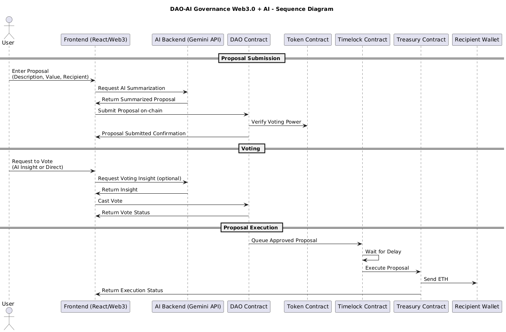

# DAO AI Governance


**DAO AI Governance** is a cutting-edge **Web3 platform** that combines **decentralized governance** with **AI-powered decision-making**. It allows DAOs to **create, vote, delegate, and execute proposals** while leveraging **AI-driven insights** to evaluate proposal risks, ROI predictions, and actionable recommendations.

This project demonstrates how **blockchain and AI can work together** to create **transparent, intelligent, and efficient decentralized communities**.

---

## 🌐 Live Demo

- **Demo URL:** [https://your-dapp-demo.com](https://your-dapp-demo.com)
  > ⚠️ Note: The demo and all smart contracts are deployed **only on the Holesky testnet**. No mainnet ETH is used for demo now.  
  > Users can get test ETH from the **Holesky faucet** here: [Holesky Faucet](https://cloud.google.com/application/web3/faucet/ethereum/holesky)  
  > This allows safe testing and interaction with the DAO platform.
  > For other network you can deploy as you want.

### Screenshots


---

---

## 🛠 Tech Stack

- **Blockchain:** Ethereum (Hardhat)
- **Smart Contracts:** Solidity (DAO, Token, Timelock, Treasury)
- **Upgradability:** All contracts are **upgradable using OpenZeppelin UUPS Proxy pattern**
- **Frontend:** React, Tailwind CSS
- **Backend:** Node.js, Express
- **AI:** Google Gemini API
- **Wallet Integration:** MetaMask

---

## 🌐 Project Overview

- **Web3 Governance:** Users interact with DAO smart contracts directly via their wallets.
- **AI Integration:** Proposal summaries, risk assessment, ROI predictions, and recommendations are generated in real-time using **Google Gemini AI**.
- **Full-stack Architecture:** Combines **React frontend**, **Node.js backend**, and **Ethereum smart contracts** for a seamless DAO experience.

Key goals:

- Enable data-driven DAO decision-making.
- Automate proposal evaluation using AI.
- Provide real-time voting and treasury analytics.

---

## ⚡ Key Features

### Web3 & Smart Contracts

- Proposal lifecycle: **Pending → Active → Succeeded → Queued → Executed**.
- Voting using **ERC-20 governance tokens**.
- Multi-signature treasury management for secure fund execution.
- State-aware proposal management: queue, execute, and track proposals.
- **Upgradable Contracts:** All smart contracts can be upgraded safely without losing state.

### AI-Powered Insights

- **Proposal Summarization:** Condenses long proposals into concise, neutral summaries.
- **Risk Analysis:** AI generates a **risk score** (0-100) for each proposal.
- **ROI Prediction:** Estimates potential returns for treasury allocations.
- **Actionable Recommendations:** Approve, reject, or defer proposals.
- **Justification:** AI provides detailed reasoning for its insights.

### Frontend (React + Tailwind)

- Real-time DAO stats: treasury balance, total supply, proposals, and voting power.
- Tab-based proposal views: **Details**, **Votes**, **AI Insights**, **Execution**.
- Responsive and interactive UI with animated backgrounds and smooth transitions.

### Backend (Node.js + Express)

- REST API endpoints:
  - `/ai/summarize` → Generates AI summaries.
  - `/ai/insights` → Returns AI-driven proposal insights.
- Integrates **Google Gemini AI** for intelligent analysis.
- Handles input validation, error management, and JSON parsing for AI responses.

---

---

## 🏗 Architecture Overview

### Component Diagram


### Sequence Diagram



---

## 🛰 Deployed Contracts (Holesky Testnet)

All smart contracts for **DAO AI Governance** are deployed on the **Holesky testnet**. You can view the transactions and contract details via the Holesky block explorer.

| Contract       | Address                                      | Explorer Link                                                                                      |
| -------------- | -------------------------------------------- | -------------------------------------------------------------------------------------------------- |
| DAO Governance | `0x901Dd499c32Afb7F860B75df521040d950865586` | [View on Holesky](https://holesky.etherscan.io/address/0x901Dd499c32Afb7F860B75df521040d950865586) |
| Token (ERC20)  | `0x36922890655De3106f42aC3f8354C15DB3983e1a` | [View on Holesky](https://holesky.etherscan.io/address/0x36922890655De3106f42aC3f8354C15DB3983e1a) |
| Timelock       | `0x4E16c65C1dD02D295C4612c0Ec3AD53758d0459f` | [View on Holesky](https://holesky.etherscan.io/address/0x4E16c65C1dD02D295C4612c0Ec3AD53758d0459f) |
| Treasury       | `0xC9A13D4D1c3FCa8ce23caA0905C988669EbC7396` | [View on Holesky](https://holesky.etherscan.io/address/0xC9A13D4D1c3FCa8ce23caA0905C988669EbC7396) |

> ⚡ Note: All contracts are **upgradable**, so addresses remain the same even after upgrades via proxy contracts.

---

## 🔄 How It Works

1. **Proposal Submission**  
   User submits a proposal with description, requested ETH, and recipient address.
2. **AI Summarization**
   - Generates a concise, neutral summary.
   - Highlights purpose and requested funds.
3. **AI Insights Generation**
   - Provides **risk score** and **ROI prediction**.
   - Recommends **Approve/Reject** with justification.
4. **Voting**
   - Users vote directly or with AI insights.
   - DAO contract verifies votes via Token contract.
5. **Proposal Execution**
   - Approved proposals are queued in **Timelock**.
   - After delay, **Treasury** executes ETH transfer to recipient.
6. **User Feedback**
   - Users see proposal & execution status in real-time.

---

## 🚀 Roadmap

- Multi-language AI support.
- Layer 2 integration for cheaper gas fees.
- AI-powered prediction of proposal outcomes.
- NFT-based voting rights.
- Security audits for smart contracts.
- Continuous improvement of upgradable contracts.

---

## 🔒 Security & Upgradability

- All smart contracts are **upgradable via OpenZeppelin proxies**, allowing safe enhancements while preserving state.
- Proposal execution and treasury operations are **timelocked for added security**.
- Follows **OpenZeppelin best practices** for proxy-based upgrades.
- Planned **audit before mainnet deployment**..

---

## 🧠 AI Workflow

1. **Proposal Submission**  
   User submits a proposal with description, requested ETH, and receipt address.

2. **AI Summarization**

   - Generates a neutral, concise summary of the proposal.
   - Highlights purpose and requested funds.

3. **AI Insights Generation**

   - Provides **risk score** and **ROI prediction**.
   - Recommends **Approve/Reject**.
   - Supplies detailed justification for the recommendation.

4. **User Action**  
   Users can review AI insights before voting, delegating, or executing proposals.

---

## 🛠 Installation

1. **Clone repository**

```bash
git clone https://github.com/molalign8468/DAO-AI-Governance.git
cd DAO-AI-Governance
npm install
```

2. **Configure environment variables**

- ### Create a `.env ` file:

```bash
PRIVATE_KEY=your-wallet-private-key
RPC_URL=https://your-rpc-provider-url
CHAIN_ID=your-chain-id

```

3. **Compile contracts**

```bash
npx hardhat compile
```

4. **Run tests**

```bash
npx hardhat test
```

5. **Deploy contracts**

```bash
npx hardhat run scripts/deploy.js --network holesky
```

6. **Install dependencies**

- ### Frontend

```bash
cd dao-frontend
npm install
```

- ### Backend

```bash
cd AI-backend
npm install
```

7. **Setup environment variables (`AI-backend/.env`)**

```bash
PORT=4000
Gemini_API_KEY=your_google_gemini_api_key
```

8. **Run the project**

```bash
nodemon server.js #Backend
npm run dev #Frontend
```

## ❓ FAQ

<details>
  <summary>Are the smart contracts upgradeable?</summary>
  <p>Yes, all contracts (DAO, Token, Timelock, Treasury) are designed to be upgradeable via proxy contracts for safe enhancements.</p>
</details>
<details>
  <summary>Can users vote without AI insights?</summary>
  <p>Yes, voting can be done directly on-chain without requesting AI insights.</p>
</details>

<details>
  <summary>What happens if a proposal fails?</summary>
  <p>Failed proposals are recorded on-chain but are not executed; treasury funds remain safe.</p>
</details>

<details>
  <summary>How does Timelock work?</summary>
  <p>Approved proposals are queued in the Timelock contract for a set delay. This prevents instant execution and allows review before funds are released.</p>
</details>

## 🤝 Contributing

1. Fork the repository
2. Create a feature branch: `git checkout -b feature/awesome-feature`
3. Commit your changes: `git commit -m "feat: description"`
4. Push to your branch: `git push origin feature/awesome-feature`
5. Open a pull request

---

## 📄 License

This project is licensed under the **MIT License**.

---

## 📬 Contact

- GitHub: [molalign8468](https://github.com/molalign8468)
- LinkedIn: [Molalign Getahun](https://www.linkedin.com/in/molalign-getahun-6a995131b/)
- Twitter/X: [@molalign52091](https://x.com/molalign52091)
